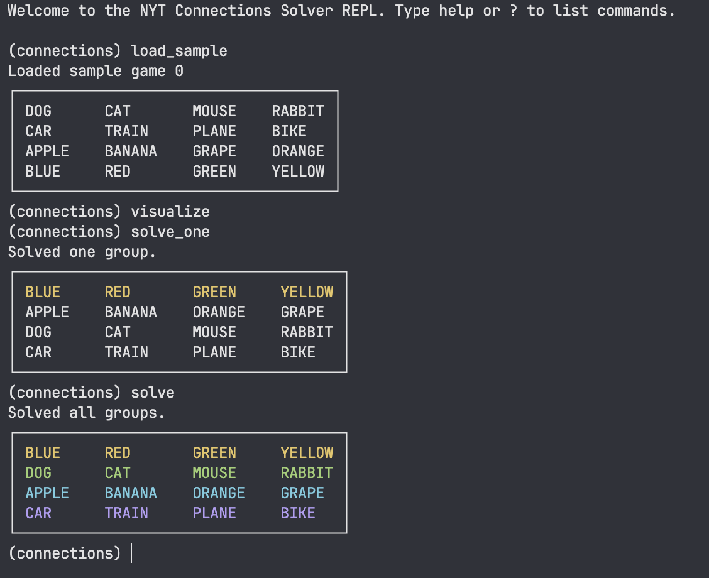
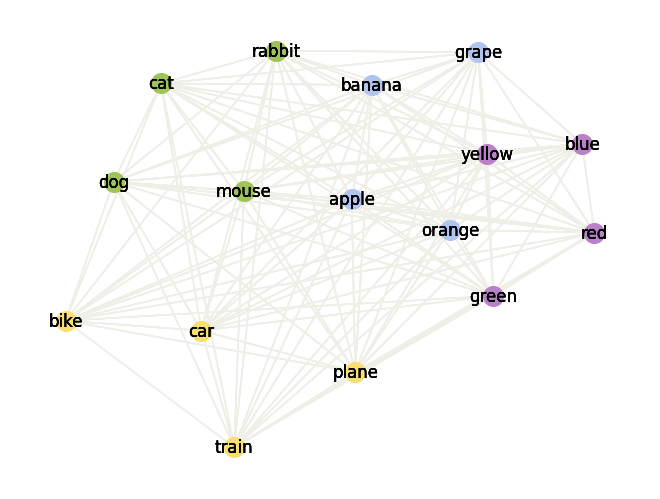
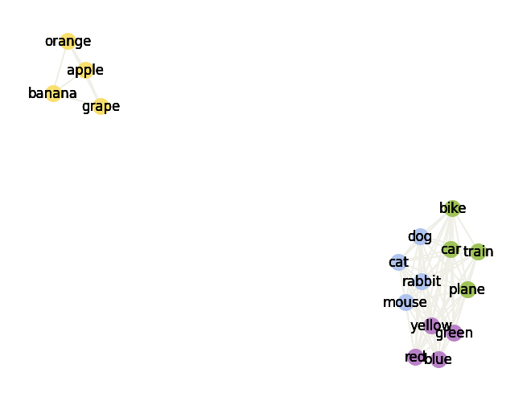
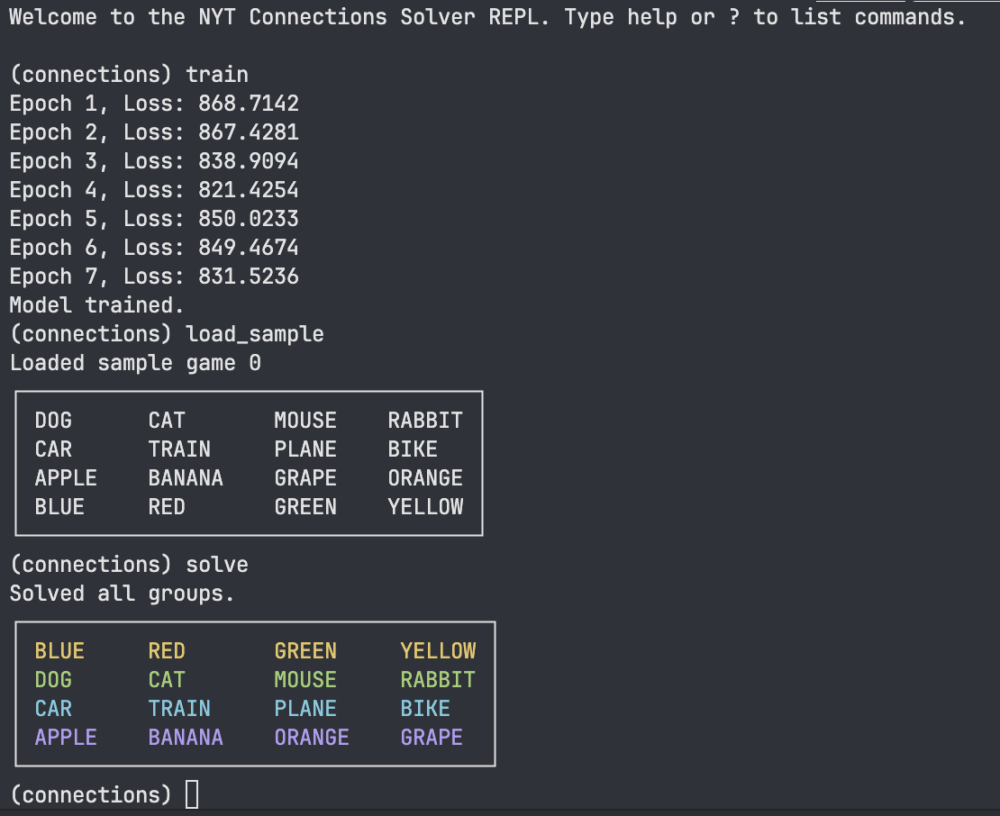

# nyt-connections-solver
Solving the NYT Connections using graph partitioning and word vectors 

## Contains:
- `main.py`: The solver for the NYT Connections game as a python file which runs a repl
- `main.ipynb`: The solver for the NYT Connections game as a jupyter notebook

## How it works:
### Word Vectors
Words can be expressed as vectors using a technique called word vectors or word embeddings. The idea is that instead of representing words as one-hot vectors or just as strings of characters, we can represent them as vectors in a high-dimensional space, allowing us to capture some of the semantic meaning of the words. For example, the word "king" might be represented as a vector that is close to the vector for "queen", and far away from the vector for "car". Moreover, we can combine these vectors to create new vectors that represent the meaning of the combination of the words. For example, the vector for "king" might be close to the vector for "queen" plus the vector for "man". This allows us to better compare the words and find similarities between them.

We can use pre-trained word vectors from the `spacy` library, and we can also train our own word vectors on some data from the NYT Connections game, which should help our model to better understand what type of connections are made in the game.

### Graph Partitioning
The idea is to represent the words as a graph, where each word is a node and the edges between them are the cosine similarity between the word vectors. The goal is to partition the graph into 4 groups of 4 words each, such that the words in each group are more similar to each other than to the words in the other groups. This is done using a technique called spectral clustering, which uses the eigenvalues and eigenvectors of the Laplacian matrix of the graph to find the best partitioning of the graph. 

## Using the solver
`main.py` opens a repl where you can:
<!-- do_load_sample(self, arg):
do_input_game(self, arg):
do_guess(self, arg):
do_suggest(self, arg):
do_solve_one(self, arg):
do_solve(self, arg):
do_print(self, arg):
do_visualize(self, arg):
do_train(self, arg):
do_functions(self, arg):
do_exit(self, arg):
do_EOF(self, arg): -->

- Load a sample game `load_sample`
- Input a game `input_game`
- Guess a word `guess`
- Suggest a connection `suggest`
- Solve one connection `solve_one`
- Solve the game `solve`
- Print the current game `print`
- Visualize the current game `visualize`
- Train the model `train`
- Ask for help `help`

## Example
### Using the Base Word Vectors

#### Graph Visualization

*Start of game*

*After solving the first connection*

### Using the Trained Word Vectors

Training the model on the NYT Connections game data improves the performance of the solver on more difficult games. The model is trained on the NYT Connections game data, which consists of a small number of games, so maybe more data is needed to improve the performance of the model. 
